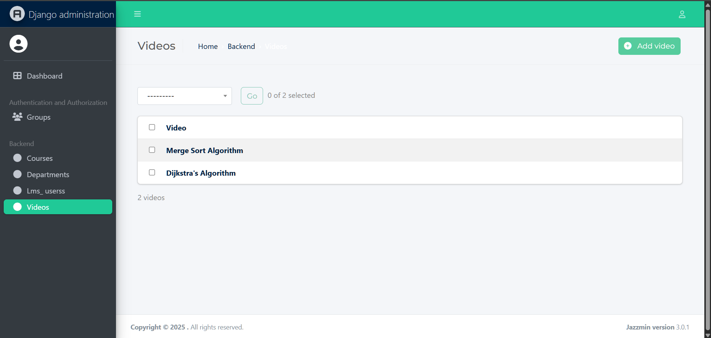

# SVEC Learning Management System

A modern Learning Management System (LMS) built for Sri Vasavi Engineering College to provide students with easy access to course materials and video lectures.

## Demo Access
Want to try it out? Use these demo credentials:
- **Username**: 22A81A0599
- **Password**: 123456781234

## Screenshots

### Login Page


### Home Dashboard


### Profile View


### Admin Interface


### Video Upload


## Core Features

### For Students
- **Secure Authentication**: Login system using student roll number and password
- **Course Access**: Browse and access available courses by department
- **Video Learning**: 
  - Stream course videos with HLS support (adaptive bit rate streaming)
  - Video player with previous/next navigation
  - Track video views and likes
  - Responsive sidebar for video list
- **Profile Management**:
  - View student profile details
  - Change/Reset password functionality
  - Track learning progress

### For Administrators
- **Course Management**: 
  - Upload and manage course content
  - Add course descriptions and images
  - Organize courses by department
- **Video Management**:
  - Upload video content
  - Add video descriptions and titles
  - Track video engagement metrics
- **User Management**:
  - Bulk upload users via Excel
  - Manage student accounts
  - Department-wise organization

## Tech Stack

- **Backend**: Django
- **Frontend**: HTML5, CSS3, Bootstrap 5
- **Database**: SQLite3
- **Video Streaming**: HLS (HTTP Live Streaming)
- **Authentication**: Django Authentication System

  
```

## Setting Up Development Environment

1. Clone the repository
2. Create a virtual environment:
```python
python -m venv venv
source venv/bin/activate  # On Windows: .\venv\Scripts\activate
```
3. Install dependencies:
```python
pip install -r requirements.txt
```
4. Run migrations:
```python
python manage.py migrate
```
5. Start development server:
```python
python manage.py runserver
```


Collaborations are Invited
